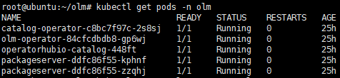
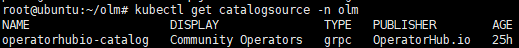
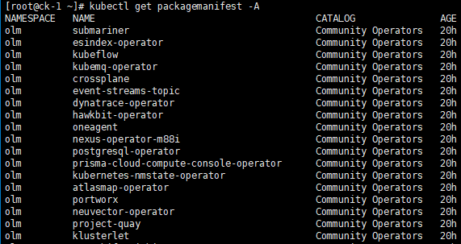
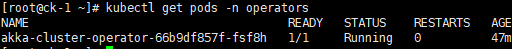

# Operator Lifecycle Manager 설치 가이드

## 구성 요소 및 버전
* OLM: ([quay.io/operator-framework/olm:0.15.1](https://quay.io/repository/operator-framework/olm/manifest/sha256:2c389d2e380c842cbf542820ad4493249164302ddf0e699b0a37105d234e67ee))
* Registry Configmap: ([quay.io/operator-framework/configmap-operator-registry:v1.13.3](https://quay.io/repository/operator-framework/configmap-operator-registry/manifest/sha256:e8458dbd7cc7650f0e84bb55cb1f9f30937dd0b010377634ea75f6d9a4f6ee85))
* Catalog Registry ([quay.io/operator-framework/upstream-community-operators:latest](https://quay.io/repository/operator-framework/upstream-community-operators/manifest/sha256:abaa54d83d2825c7d2bc9367edbc1a3707df88e43ded36ff441398f23f030b6e))

## Prerequisites
* git
* go version v1.12+.
* docker version 17.03+.
  * Alternatively podman v1.2.0+ or buildah v1.7+
* kubectl version v1.11.3+.
* Access to a Kubernetes v1.11.3+ cluster.

## 폐쇄망 구축 가이드
설치를 진행하기 전 아래의 과정을 통해 필요한 이미지 및 yaml 파일을 준비한다.
1. **폐쇄망에서 설치하는 경우** 사용하는 image repository에 Operator Lifecycle Manager 설치 시 필요한 이미지를 push한다. 

    * 작업 디렉토리 생성 및 환경 설정
    ```bash
    $ mkdir -p ~/olm-install
    $ export OLM_HOME=~/olm-install
    $ export OLM_VERSION=0.15.1
    $ export CFM_VERSION=v1.13.3
    $ export REG_VERSION=latest
    $ export REGISTRY= XXX.XXX.XXX.XXX:XXXX (e.g.192.168.6.100:5000)
    $ cd $OLM_HOME
    ```
    * 외부 네트워크 통신이 가능한 환경에서 필요한 이미지를 다운받는다.
    ```bash
    $ sudo docker pull quay.io/operator-framework/olm:${OLM_VERSION}
    $ sudo docker save quay.io/operator-framework/olm:${OLM_VERSION} > olm_${OLM_VERSION}.tar
    $ sudo docker pull quay.io/operator-framework/configmap-operator-registry:${CFM_VERSION}
    $ sudo docker save quay.io/operator-framework/configmap-operator-registry:${CFM_VERSION} > configmap_${CFM_VERSION}.tar
    $ sudo docker pull quay.io/operator-framework/upstream-community-operators:${REG_VERSION}
    $ sudo docker save quay.io/operator-framework/upstream-community-operators:${REG_VERSION} > registry_${REG_VERSION}.tar    
    ```
    * install yaml을 다운로드한다.
    ```bash
    $ wget -O hypercloud-install.tar.gz https://github.com/tmax-cloud/hypercloud-install-guide/archive/v${INSTALL_GUIDE_VERSION}.tar.gz
    $ cd OLM/manifest
    ```
  
2. 위의 과정에서 생성한 tar 파일들을 폐쇄망 환경으로 이동시킨 뒤 사용하려는 registry에 이미지를 push한다.
    ```bash
    $ sudo docker load < olm_${OLM_VERSION}.tar
    
    $ sudo docker tag quay.io/operator-framework/olm:${OLM_VERSION} ${REGISTRY}/operator-framework/olm:${OLM_VERSION}
    
    $ sudo docker push ${REGISTRY}/operator-framework/olm:${OLM_VERSION}
    
    $ sudo docker load < configmap_${CFM_VERSION}.tar
    
    $ sudo docker tag quay.io/operator-framework/configmap-operator-registry:${CFM_VERSION} ${REGISTRY}/operator-framework/configmap-operator-registry:${CFM_VERSION}
    
    $ sudo docker push ${REGISTRY}/operator-framework/configmap-operator-registry:${CFM_VERSION}
    
    $ sudo docker tag quay.io/operator-framework/upstream-community-operators:${REG_VERSION} ${REGISTRY}/operator-framework/upstream-community-operators:${REG_VERSION}
    
    $ sudo docker push ${REGISTRY}/operator-framework/upstream-community-operators:${REG_VERSION}
    ```
    
3. 설치할 Operator 이미지를 폐쇄망에서 다운받기 위해 Custom Registry에 폐쇄망 정보 입력  빌드한다. (e.g. Akka Cluster Operator 1.0.0) 
    ```bash
    $ cd private
    
    $ cp bin/* /bin/
    
    $ sed -i 's/{registry}/'${REGISTRY}'/g' catalog_build.sh
    
    $ sed -i 's/{registry}/'${REGISTRY}'/g' akka_1.0.0/akka-cluster-operator.v1.0.0.clusterserviceversion.yaml
    
    $ sh catalog_build.sh
    ```
    
4. Custom Registry를 폐쇄망 환경에 구성한다.
    ```bash
    $ sed -i 's/{registry}/'${REGISTRY}'/g' custom_catalogsource.yaml
    
    $ kubectl apply -f custom_catalogsource.yaml
    ```
    
5. Custom Registry에서 관리하는 Operator의 Container Image를 미러링한다.
    ```bash
    $ sed -i 's/{registry}/'${REGISTRY}'/g' akka_image.sh
    
    $ sh akka_image.sh
    ```    
    

## 설치 가이드
0. [olm yaml 수정](https://github.com/tmax-cloud/install-OLM/blob/main/README.md#step-0-olm-yaml-%EC%88%98%EC%A0%95-%EC%88%98%EC%A0%95)
1. [crds 생성](https://github.com/tmax-cloud/install-OLM/blob/main/README.md#step-1-crds-%EC%83%9D%EC%84%B1)
2. [OLM 설치](https://github.com/tmax-cloud/install-OLM/blob/main/README.md#step-2-olm-%EC%84%A4%EC%B9%98)
3. [동작 확인](https://github.com/tmax-cloud/install-OLM/blob/main/README.md#step-3-%EB%8F%99%EC%9E%91-%ED%99%95%EC%9D%B8)

## Step 0. olm yaml 수정 수정
* 목적 : `olm yaml에 이미지 버전 정보를 수정`
* 생성 순서 : 아래의 command를 실행하여 사용하고자 하는 image 버전을 수정한다. ([02_olm.yaml](yaml/02_olm.yaml))
    ```bash
    $ sed -i 's/{olm_version}/'${OLM_VERSION}'/g' 02_olm.yaml
    $ sed -i 's/{configmap_version}/'${CFM_VERSION}'/g' 02_olm.yaml
    $ sed -i 's/{registry_version}/'${REG_VERSION}'/g' 02_olm.yaml
    ```
    
* 비고 :
    * 폐쇄망에서 설치를 진행하여 별도의 image registry를 사용하는 경우 registry 정보를 추가로 설정해준다.
	```bash
	$ sed -i 's/quay.io\operator-framework/'${REGISTRY}'\/operator-framework/g' 02_olm.yaml
	```


## Step 1. CRDs 생성
* 목적 : `OLM 설치를 위해 필요한 CRDs를 배포한다.`
* 생성 순서 : [01_crds.yaml](manifest/01_crds.yaml) 실행 `ex) kubectl apply -f 01_crds.yaml`


## Step 2. OLM 설치
* 목적 : `OLM 동작을 위해 필요한 리소스 (namespace, clusterrole, deployment 등)를 생성한다.`
* 생성 순서
  * [02_olm.yaml](manifest/02_olm.yaml) 실행 `ex) kubectl apply -f 02_olm.yaml`
  
  * 아래의 명령어를 사용하여 OLM이 정상적으로 설치되었는지 확인한다.
  ```bash
    $ kubectl get pods -n olm
    $ kubectl get catalogsource -n olm
   ```
  
  
  
## Step 3. 동작 확인
* 목적 : `OLM이 정상적으로 동작하는지 확인한다.`
* 순서
  * `kubectl get packagemanifest -A`를 실행하여 OLM에서 관리하는 Operator 목록이 조회되는지 확인한다.
  * `kubectl apply -f 03_sample.yaml`를 실행하여 Operator 설치가 정상적으로 수행되는지 확인한다. (* 폐쇄망 구축 시, ([../private/03_sample_private.yaml](private/03_sample_private.yaml)) 실행)
 
  
  
  
## 삭제 가이드
1. [사용중인 리소스 제거](https://github.com/tmax-cloud/install-OLM/blob/main/README.md#step-1-%EC%82%AC%EC%9A%A9%EC%A4%91%EC%9D%B8-%EB%A6%AC%EC%86%8C%EC%8A%A4-%EC%A0%9C%EA%B1%B0)
2. [설치 리소스 제거](https://github.com/tmax-cloud/install-OLM/blob/main/README.md#step-2-%EC%84%A4%EC%B9%98-%EC%A0%9C%EA%B1%B0)
3. [CRD 제거](https://github.com/tmax-cloud/install-OLM/blob/main/README.md#step-3-crd-%EC%A0%9C%EA%B1%B0)

## Step 1. 사용중인 리소스 제거
* 목적 : `사용중인 리소스 차례로 제거`
* 삭제 순서 : 아래의 command 순서대로 적용
    ```bash
    $ kubectl delete subscription --all --all-namespaces
    $ kubectl delete csv --all --all-namespaces
    ```
## Step 2. 설치 제거
* 목적 : `사용중인 리소스 차례로 제거`
* 삭제 순서 : 아래의 command로 yaml 적용
    ```bash
    $ kubectl delete -f manifest/custom_catalogsource.yaml (* 폐쇄망 구축했을 경우)
    $ kubectl delete -f manifest/02_olm.yaml
    ```
## Step 3. CRDs 제거
* 목적 : `OLM 관련 CRDs 제거`
* 삭제 순서 : 아래의 command로 yaml 적용
    ```bash
    $ kubectl delete -f manifest/01_crds.yaml
    ```
